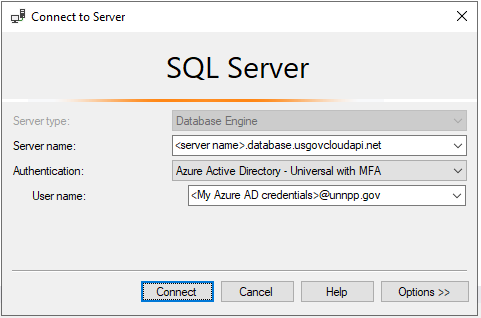

# Connect to an Azure SQL database using SQL authentication
{: .no_toc }

This tutorial describes how to connect to an Azure SQL database from 
an Azure Function using **SQL authentication** (username and password). 
If the Login and User already exist, you can skip to Step 5.

See the 
[Microsoft Docs](https://docs.microsoft.com/en-us/azure/azure-functions/functions-dotnet-dependency-injection)
for further information on function dependency injection.

## Prerequisites

- Visual Studio or VS Code
- SQL Server Management Studio (SSMS)
- Azure SQL database
- Microsoft.Data.SqlClient

## 1. Get the server connection string

Database connection strings can be found in the Azure Portal **SQL Database** 
blade under Settings > Connection Strings


## 2. Connect to the server instance

Open SQL Server Management Studio (SSMS) and connect to the Azure SQL 
database server **as an admin**. Only admins are able to create new Logins.



## 3. Create a new Login

From the SSMS toolbar, select the **master** database. Execute the following 
command to create a new Login.

``` sql
-- Create login
CREATE LOGIN <SomeUser> 
WITH PASSWORD = '<SomePassword>' 
```

## 4. Create a new User

From the SSMS toolbar, select the database you want to connect to. Execute 
the following commands to create a new User and add them to the 
db_datareader and db_datawriter roles.

``` sql
-- Create a user for the login
CREATE USER <SomeUser>
FOR LOGIN <SomeUser>
WITH DEFAULT_SCHEMA = dbo;

-- Add user to role(s)
ALTER ROLE db_datareader ADD MEMBER <SomeUser>; 
ALTER ROLE db_datawriter ADD MEMBER <SomeUser>; 

```

## 5. Connect to the database from a Function

Important: When using SQL authentication the credentials must be stored 
in a Key Vault. 

``` csharp
using System;
using System.Collections.Generic;
using System.Net.Http;
using System.Threading.Tasks;s
using Microsoft.AspNetCore.Http;
using Microsoft.AspNetCore.Mvc;
using Microsoft.Azure.WebJobs;
using Microsoft.Azure.WebJobs.Extensions.Http;
using Microsoft.Data.SqlClient;
using Microsoft.Extensions.Logging;

namespace DH.Integration.AzureFunction
{
    public static class DatabaseFunction
    {
        [FunctionName("DatabaseFunction")]
        public static async Task<IActionResult> Run(
            [HttpTrigger(AuthorizationLevel.Function, "get", "post", Route = null)] HttpRequest req,
            ILogger log)
        {
            // Create and open database connection
            string connectionString = Environment.GetEnvironmentVariable("ConnectionString");
            using SqlConnection connection = new(connectionString);
            await connection.OpenAsync();

            // Execute query
            string query = "SELECT * FROM dbo.Person";
            using SqlCommand command = new(query, connection);
            using SqlDataReader reader = await command.ExecuteReaderAsync();

            IList<PersonModel> people = new List<PersonModel>();

            while (reader.Read())
            {
                people.Add(new PersonModel
                {
                    PersonId = reader.GetInt32(0), 
                    FirstName = reader.GetString(1),
                    MiddleInitial = reader.GetString(2), 
                    LastName = reader.GetString(3)
                });
            }

            // Return a JSON array of people
            return new OkObjectResult(people);
        }

        private class PersonModel
        {
            public int PersonId { get; set; }
            public string FirstName { get; set; }
            public string MiddleInitial { get; set; }
            public string LastName { get; set; }
        }
    }
}
```
