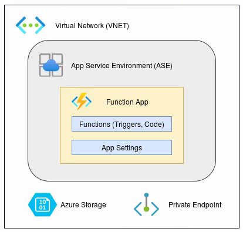

# Infrastructure
{: .no_toc }

Function Apps run within an App Service Enviornment (ASE). They provide an 
execution context in which the functions run. They are managed by the 
DevOps infrastructure team.

Functions are the primary concept in Azure Functions. A function contains two
important pieces - code and the function.json file. The function.json file
defines the function's trigger, bindings, and other configuration settings.
For compiled languages like C#, this configuration file is automatically 
generated from code annotations.

## Service Limits

A full list of service limits can be found in the 
[Microsoft Docs](https://docs.microsoft.com/en-us/azure/azure-functions/functions-scale)

| Default timeout duration  | 30 minutes    |
| Max instance count        | 100           |
| Max request size          | 100 MB        |
| Max query string length   | 4096          |
| Max request URL length    | 8192          |

*Note: Cold start is a non-issue when running within an ASE/dedicated host.*