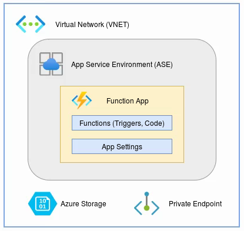

# Functions Infrastructure
{: .no_toc }

**Function Apps** run within an App Service Enviornment (ASE). They provide an 
execution context for running the functions and are managed by the 
DevOps infrastructure team.

**Functions** are the primary concept in Azure Functions. The hosting model 
for functions allow multiple function invocations to run concurrently on a 
single compute instance.

## Service Limits

A full list of service limits can be found in the 
[Microsoft Docs](https://docs.microsoft.com/en-us/azure/azure-functions/functions-scale){:target="_blank"}.

| Default timeout duration  | 30 minutes    |
| Max instance count        | 100           |
| Max request size          | 100 MB        |
| Max query string length   | 4096          |
| Max request URL length    | 8192          |

*Note: Cold start is a non-issue when running within an ASE (dedicated host).*