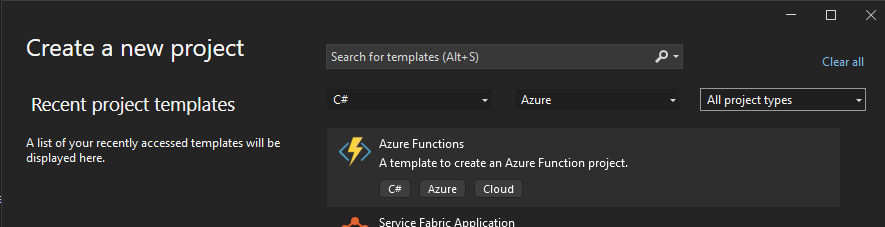
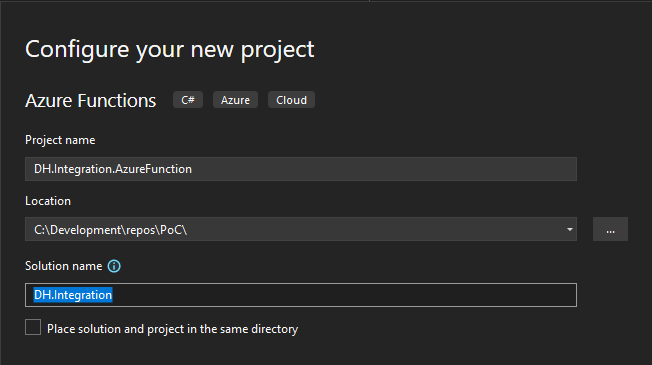
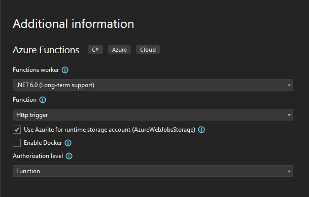
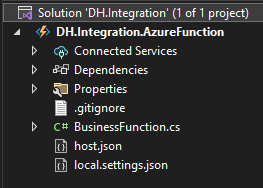
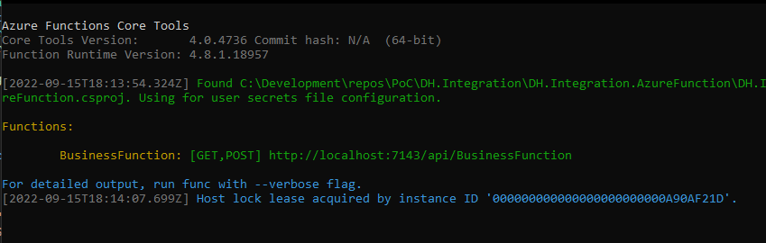
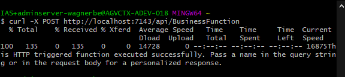
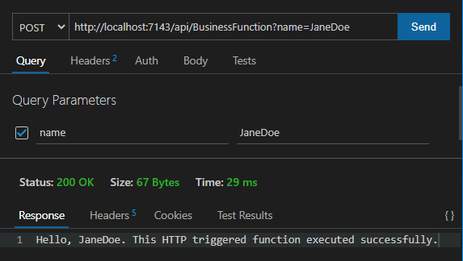
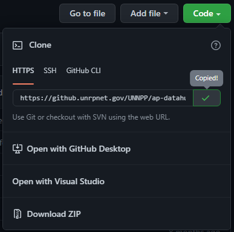

# Functions Local Development
{: .no_toc }

- TOC
{:toc}

## Environment

Functions are developed locally in Visual Studio with 
[Azure Functions Core Tools](https://docs.microsoft.com/en-us/azure/azure-functions/functions-run-local).

- Microsoft Windows
- Visual Studio or VS Code
- Azurite (storage emulator)
- Azure Functions Core Tools
- Thunder Client, VS Code extension REST client (optional)

*Note: Some developers have reported issues when trying to run Functions 
in VS Code (as of 9/14/2022).*

## How to create a new C# Function App?

1. Open Visual Studio 2022 and create a new project using the 
**Azure Functions** template.

    

2. Enter a **Project name** using the following naming convention:

    DH.{Component/Integration}.AzureFunction

    

3. On the Additional Information screen, select the desired trigger 
(defaulted to Http trigger).

    

4. Your solution folder structure should look similar to the following.

    

    [host.json](https://docs.microsoft.com/en-us/azure/azure-functions/functions-host-json)
    lets you configure the Functions host. These settings apply both when 
    running locally and in Azure.

    [local.settings.json](https://docs.microsoft.com/en-us/azure/azure-functions/functions-run-local?tabs=v4%2Cwindows%2Ccsharp%2Cportal%2Cbash#local-settings)
    stores the app settings and connection strings used for local 
    development.

5. Open the function file (BusinessFunction.cs). The **FunctionName** attribute 
for Run indicates the method is the entry point for the function.

    ``` csharp
    public static class BusinessFunction
    {
        [FunctionName("BusinessFunction")]
        public static async Task<IActionResult> Run(
            [HttpTrigger(AuthorizationLevel.Function, "get", "post", Route = null)] HttpRequest req,
            ILogger log)
        {
            log.LogInformation("C# HTTP trigger function processed a request.");

            string name = req.Query["name"];

            string requestBody = await new StreamReader(req.Body).ReadToEndAsync();
            dynamic data = JsonConvert.DeserializeObject(requestBody);
            name = name ?? data?.name;

            string responseMessage = string.IsNullOrEmpty(name)
                ? "This HTTP triggered function executed successfully. Pass a name in the query string or in the request body for a personalized response."
                : $"Hello, {name}. This HTTP triggered function executed successfully.";

            return new OkObjectResult(responseMessage);
        }
    }
    ```

6. Press F5 to start the function in debug mode. You might be prompted to 
enable Windows firewall exception.

    

7. Test executing the function using cURL or with Thunder Client 
VS Code extension.

    

    

## How to make changes to an existing function app?

1. Browse to the function app repo in GitHub Enterprise Server (GHES). On 
the **Code** tab, click the **Code** dropdown and copy the URL.

    

2. Clone the repo to your local development environment.

    ``` bash
    git clone https://github.unrpnet.gov/UNNPP/<my-function-app-repo>.git
    ```

3. Create a new branch that is based on the function app's **main** branch.

    ``` bash
    git checkout -b <new feature/bug branch name>
    ```

4. Implement the code changes and commit them to your feature/bug branch.

    ``` bash
    git commit -m "<My commit message>"
    git push
    ```

5. When ready to merge the code changes into **main**, create a 
new pull request (PR) in GitHub Enterprise Server (GHES). The pull request 
will need to be approved by a **Data Hub Integrator** before it can be merged. 
In addition, if the pull request involves any infrastructure 
changes (Terraform), it will need to be approved by a member of the 
**DevOps Infrastructure** team.

## Developer guides

[Microsoft Developer Guide](https://docs.microsoft.com/en-us/azure/azure-functions/functions-reference?tabs=blob)
[Quickstart: Create your first C# function in Azure using Visual Studio](https://docs.microsoft.com/en-us/azure/azure-functions/functions-create-your-first-function-visual-studio?tabs=in-process)
[Quickstart: Create a C# function in Azure using Visual Studio Code](https://docs.microsoft.com/en-us/azure/azure-functions/create-first-function-vs-code-csharp?tabs=in-process)
[Quickstart: Create a JavaScript function in Azure using Visual Studio Code](https://docs.microsoft.com/en-us/azure/azure-functions/create-first-function-vs-code-node)
