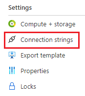

# Connect to Azure SQL (using SQL authentication)
{: .no_toc }

- TOC
{:toc}

## Prerequisites

- Azure SQL database
- Visual Studio or VS Code
- Microsoft.Data.SqlClient

## Instructions

### 1. Get the connection string

The database connection strings can be found in the Azure Portal 
**SQL Database** blade under Settings > Connection Strings, and copy the 
**ADO.NET (SQL authentication)** connection string.



### 2. Connect to the database from a function

Connect to the Azure SQL database using an Azure AD 
[Service Principal](https://learn.microsoft.com/en-us/azure/active-directory/develop/app-objects-and-service-principals).
The SQL authentication credentials must be stored in a Key Vault. It can be 
accessed from a function app using an app setting along with the 
[Key Vault reference syntax](https://learn.microsoft.com/en-us/azure/app-service/app-service-key-vault-references).
There are two forms of the reference syntax.
```
@Microsoft.KeyVault(SecretUri=https://myvault.vault.azure.net/secrets/mysecret/)
@Microsoft.KeyVault(VaultName=myvault;SecretName=mysecret)
```

The following C# code shows how to connect to an Azure SQL database and
run a simple query.

``` csharp
using System;
using System.Collections.Generic;
using System.Net.Http;
using System.Threading.Tasks;s
using Microsoft.AspNetCore.Http;
using Microsoft.AspNetCore.Mvc;
using Microsoft.Azure.WebJobs;
using Microsoft.Azure.WebJobs.Extensions.Http;
using Microsoft.Data.SqlClient;
using Microsoft.Extensions.Logging;

namespace DH.Integration.AzureFunction
{
    public static class DatabaseFunction
    {
        [FunctionName("DatabaseFunction")]
        public static async Task<IActionResult> Run(
            [HttpTrigger(AuthorizationLevel.Function, "get", "post", Route = null)] HttpRequest req,
            ILogger log)
        {
            // Create and open database connection
            string connectionString = Environment.GetEnvironmentVariable("ConnectionString");
            using SqlConnection connection = new(connectionString);
            await connection.OpenAsync();

            // Execute query
            string query = "SELECT * FROM dbo.Person";
            using SqlCommand command = new(query, connection);
            using SqlDataReader reader = await command.ExecuteReaderAsync();

            IList<PersonModel> people = new List<PersonModel>();

            while (reader.Read())
            {
                people.Add(new PersonModel
                {
                    PersonId = reader.GetInt32(0), 
                    FirstName = reader.GetString(1),
                    MiddleInitial = reader.GetString(2), 
                    LastName = reader.GetString(3)
                });
            }

            // Return a JSON array of people
            return new OkObjectResult(people);
        }

        private class PersonModel
        {
            public int PersonId { get; set; }
            public string FirstName { get; set; }
            public string MiddleInitial { get; set; }
            public string LastName { get; set; }
        }
    }
}
```
