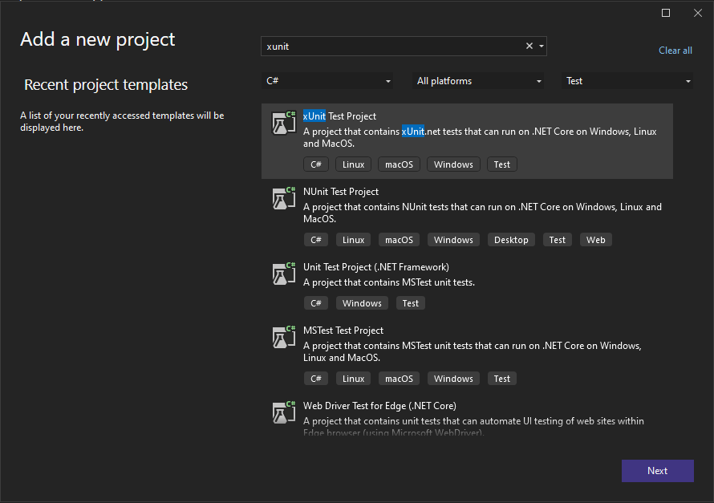
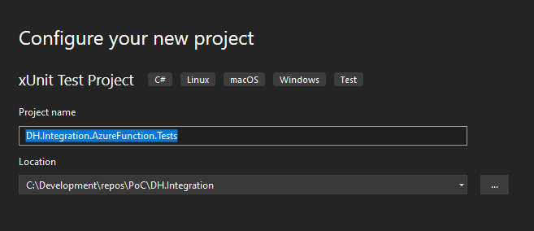
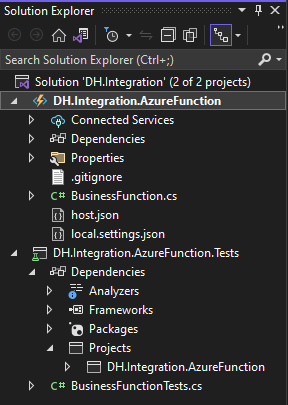
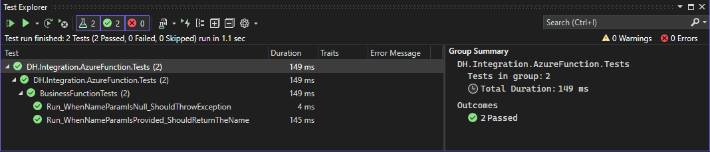
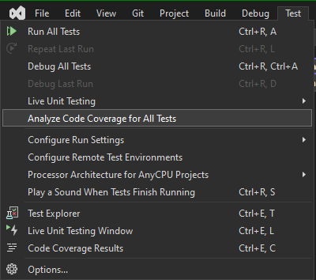
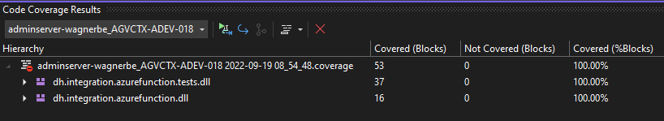

# Functions Testing
{: .no_toc }

- TOC
{:toc}

This section provides guidance for developing function automated tests 
using Visual Studio, C#, and 
[xUnit](https://xunit.net/docs/getting-started/netcore/cmdline).

## Characteristics of a good unit test (FIRST)

- **F**ast: Tests should take very little time to run.
- **I**solated: Tests should never depend on other test cases. Should be 
able to run any test, at any time, in any order.
- **R**epeatable: Tests should produce the same results every run.
- **S**elf-checking: Tests should be able to automatically detect if it 
passed or failed without manual interpretation.
- **T**imely: Tests should not take a disproportionately long time to write 
when compared to the code being tested.

## Set up a testing project

### 1. Add a xUnit Test Project

Open the function solution in Visual Studio and add a new **xUnit Test Project**.



### 2. Configure a xUnit project

For the **Project name** use the following naming convention:

DH.{Integration}.AzureFunction.Tests



### 3. Add function project reference

In the test project add a reference to the function project. Your solution
structure should look similar to the following.



### 4. Add unit tests

Add a separate test class for each function. Use the following naming 
convention for test case methods (facts and theories):

UnitOfWork_Scenario_ExpectedBehavior

When writing tests, use the 
[Arrange, Act, Assert](http://wiki.c2.com/?ArrangeActAssert)
(AAA) pattern. Test all non-trivial code paths (happy path and edge cases). 
Ensure both positive and negative testing scenarios are developed.

The following example has two test methods for the function. Notice 
that Moq and AutoFixture packages were added from NuGet to assist with 
faking data and service dependencies.

``` csharp
using AutoFixture;
using Microsoft.AspNetCore.Http;
using Microsoft.AspNetCore.Http.Internal;
using Microsoft.AspNetCore.Mvc;
using Microsoft.Extensions.Logging;
using Microsoft.Extensions.Primitives;
using Moq;
using Xunit;

namespace DH.Integration.AzureFunction.Tests
{
    public class BusinessFunctionTests
    {
        private readonly IFixture _fixture = new Fixture();
        private readonly ILogger _logger = Mock.Of<ILogger>();

        [Fact]
        public async Task Run_WhenNameParamIsNull_ShouldThrowException()
        {
            // Arrange
            var mockRequest = new Mock<HttpRequest>();

            // Act/Assert
            await Assert.ThrowsAsync<Exception>(() => BusinessFunction.Run(mockRequest.Object, _logger));
        }

        [Fact]
        public async Task Run_WhenNameParamIsProvided_ShouldReturnTheName()
        {
            // Arrange
            string expectedName = _fixture.Create<string>();
            var queryCollection = new QueryCollection(new Dictionary<string, StringValues>()
            {
                { "name", expectedName }
            });

            var mockRequest = new Mock<HttpRequest>();
            mockRequest
                .Setup(req => req.Query)
                .Returns(() => queryCollection);

            // Act
            var response = await BusinessFunction.Run(mockRequest.Object, _logger) as OkObjectResult;

            // Assert
            Assert.Equal(expectedName, response?.Value);
        }
    }
}
```

### 5. Run and debug unit tests

Run and debug the tests in Visual Studio using the 
[Test Explorer](https://docs.microsoft.com/en-us/visualstudio/test/run-unit-tests-with-test-explorer).



## Analyze code coverage

To effectively guard against bugs, tests should cover a large proportion 
of the code. A code coverage of >90% is recommended when possible. To 
calculate code coverage in Visual Studio Enterprise edition, select 
Test > Analyze Code Coverage for All Tests from the main menu. This will 
generate a .coverage file.



Select Test > Code Coverage Results from the main menu to view the results of 
coverage analysis.



Additional information on code coverage can be found in the 
[Microsoft Docs](https://docs.microsoft.com/en-us/visualstudio/test/using-code-coverage-to-determine-how-much-code-is-being-tested).

## Continuous Integration (CI)

Integrate automated unit tests into the continuous integration (CI) pipeline
with a reusable workflow in GitHub Enterprise Server (GHES). The process will 
also run code coverage analysis and output the results as an artifact of 
the pipeline run.

``` yaml
- name: Test
        run: dotnet test 
          --configuration Release 
          --no-build 
          --verbosity normal
          --results-directory TestResults
          --collect:"Code Coverage"
```

## Best Practices

- Use test-oriented development practices.
- Use a shift-left continuous testing approach, and protect against regression.
- Keep unit tests in a separate project from integration tests.
- Name unit tests using the following naming convention: UnitOfWork_Scenario_ExpectedBehavior
- Use the Arrange, Act, Assert (AAA) pattern.
- Avoid introducing dependencies into tests by following the 
[Explicit Dependencies Principle](https://deviq.com/principles/explicit-dependencies-principle) 
and using dependency injection.
- Ensure both positive and negative testing scenarios are developed.
- Integrate testing in the continuous integration pipeline (CI).

**Positive testing scenarios**: Use valid data to demonstate successful 
execution. Positive testing reinforces the way components should be used in a 
production environment.

**Negative testing scenarios**: Use invalid data to demonstrate the recovery 
of the system during a failed execution. Traditionally, there will be  
significantly more negative testing scenarios compared to positive testing 
scenarios.

See the 
[Microsoft Docs](https://docs.microsoft.com/en-us/dotnet/core/testing/unit-testing-best-practices)
for additional unit testing best practices.
