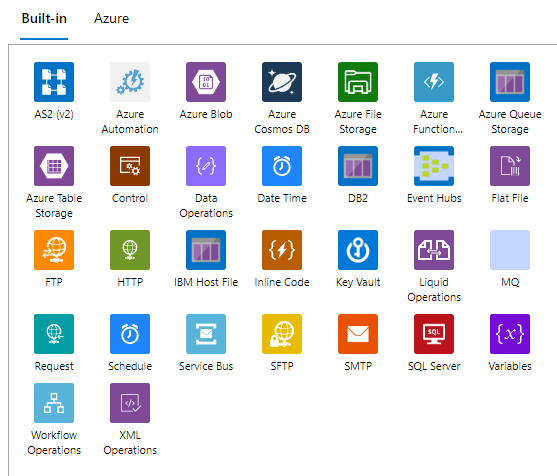
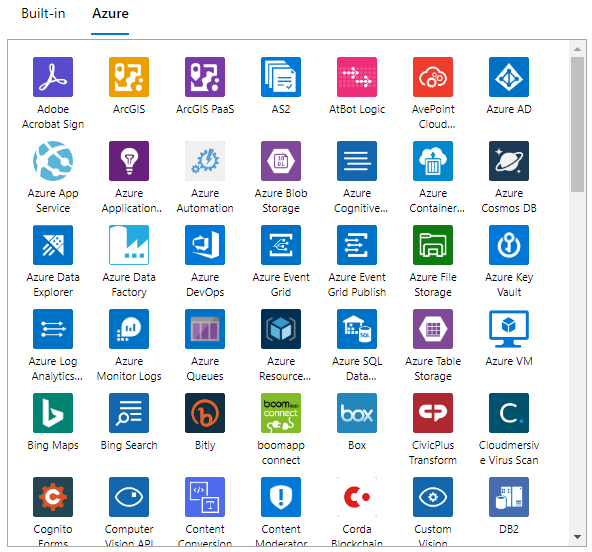

# Logic Apps Infrastructure
{: .no_toc }

- TOC
{:toc}

## What are Azure Logic App connectors?

Logic Apps 
[connectors](https://learn.microsoft.com/en-us/azure/connectors/apis-list) 
are used to access data, events, and 
resources in other apps, services, systems, protocols, and platforms. 
Azure Logic Apps provides hundreds of connectors. If no connector is 
available for accessing a certain resource, either use the generic HTTP 
operation, or create a 
[custom connector](https://learn.microsoft.com/en-us/azure/logic-apps/custom-connector-overview).

Triggers and actions are available as built-in and Azure/managed connectors. 
Some services have both connector versions available. When both are 
available, Data Hub recommends using the built-in connectors from a 
performance and cost perspective. A list of all 
[available Logic Apps connectors](https://learn.microsoft.com/en-us/connectors/connector-reference/connector-reference-logicapps-connectors) 
can be found in the Microsoft Docs.

## Built-in connectors

- Recommended in Data Hub when available.
- Run natively on the Azure Logic Apps runtime.
- Better performance. Not metered per action.
- Some connectors are also known as _service provider connectors_.
- Seamless VNet integration.
- [Roadmap](https://github.com/Azure/logicapps/discussions/530)
for future built-in connector availability.

Additional information on built-in connectors can be found in the 
[Microsoft Docs](https://learn.microsoft.com/en-us/azure/connectors/built-in).

## Azure connectors (managed)

- Deployed, hosted, and managed by Microsoft.
- Can be throttled. Metered per action.
- Requires backend service to allow traffic through the outbound 
IP addresses.

Additional information on Azure/managed connectors can be found in the 
[Microsoft Docs](https://learn.microsoft.com/en-us/azure/connectors/managed).

## Triggers

Every workflow includes a trigger, which defines the calls that instantiate 
and start the workflow. Here are the general trigger categories:

- A **polling trigger**, which checks a service's endpoint at 
regular intervals

- A **push trigger** creates a subscription to an endpoint and 
provides a callback URL so the endpoint can notify the trigger when 
the specified event happens or data is available. The trigger then 
waits for the endpoint's response before firing.

Triggers have these top-level elements, although some are optional:

| Trigger type      | Connector     | Description | 
| ----------------- | ------------- | ----------- |
| HTTP              | Built-in      | Checks or polls any endpoint. This endpoint must conform to a specific trigger contract either by using a 202 asynchronous pattern or by returning an array. | 
| HTTPWebhook       | Built-in      | Creates a callable endpoint for your logic app but calls the specified URL to register or unregister. | 
| Recurrence        | Built-in      | Fires based on a defined schedule. You can set a future date and time for firing this trigger. Based on the frequency, you can also specify times and days for running your workflow. | 
| Request           | Built-in      | Creates a callable endpoint for the logic app. Is also known as a "manual" trigger. | 
| ApiConnection     | Managed       | Checks or polls an endpoint using Microsoft-managed APIs. | 
