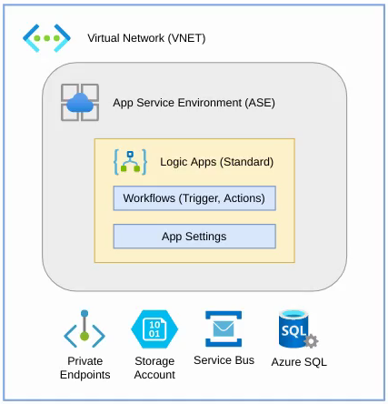

# Logic Apps Infrastructure
{: .no_toc }

- TOC
{:toc}

Azure offers two Logic Apps resource types: 
- Standard (single-tenant) 
- Consumption (multi-tenant)

Data Hub uses **Logic Apps (Standard)** running inside an 
App Service Environment (ASE) as it provides the following benefits:

- Fully isolated
- Virtual network integration and private endpoints
- Can run multiple workflows in the same Logic App
- More control and capabilities around runtime and performance settings
- Simplified CI/CD process as the infrastructure can be separated 
from the app
- Allows for both stateful and stateless workflows
- VS Code support for local development

See the 
[Microsoft Docs](https://learn.microsoft.com/en-us/azure/logic-apps/single-tenant-overview-compare) 
for a detailed comparison of Standard and Consumption.

## Service limits

The following are some notable limits for Logic Apps (Standard). Limits can be 
[adjusted in the host and app settings](https://learn.microsoft.com/en-us/azure/logic-apps/edit-app-settings-host-settings).

See the 
[Microsoft Docs](https://learn.microsoft.com/en-us/azure/logic-apps/logic-apps-limits-and-config)
for a more complete list of limits.

| Name                                          | Limit 
| --------------------------------------------- | ------------- |
| Workflow maximum name length                  | 43 characters |
| Trigger or action maximum name length         | 80 characters | 
| Actions per workflow                          | 500 actions |
| Actions nesting depth                         | 8 actions |
| Message size (chunking disabled)              | 100 MB | 
| Message size (chunking enabled)               | 1 GB (Default) | 
| Maximum variables per workflow                | 250 variables (Default) | 
| Maximum variable content size                 | Stateful workflow: 104,857,600 characters (Default) | 
| Maximum number of array items                 | 100,000 items (Default) | 
| Switch maximum number of cases per action     | 25 | 
| Read calls per 5 min                          | 60,000 | 
| Invoke calls per 5 min                        | 45,000 | 
| HTTP request timeout                          | 3.9 minutes (Default) | 
| Request URL character limit                   | 16,384 characters | 
